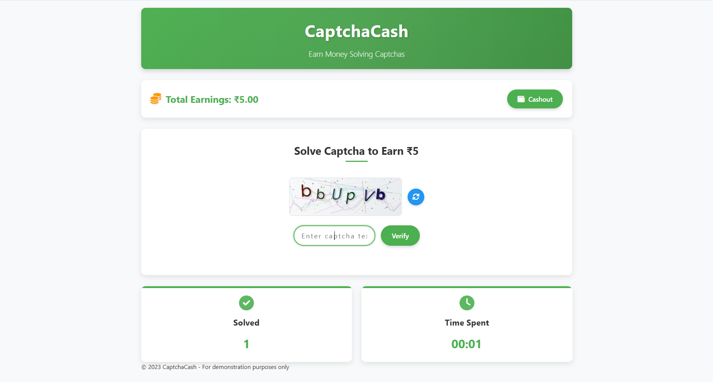
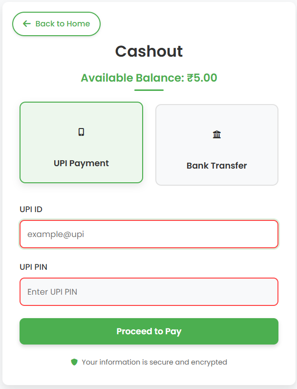

# CaptchaCash


CaptchaCash is a **frontend-only demonstration** website that simulates a platform where users can earn virtual money by solving captchas. This project is designed purely for educational purposes to showcase frontend development skills and UI/UX design principles.

## 🚨 Important Disclaimer

This is a **parody website** created for demonstration purposes only. It does not actually provide any real money or payment services. The "cashout" functionality is simulated and does not process any real transactions. This is strictly a frontend demonstration with no backend functionality.

**Note:** Scamming is illegal and a punishable offense. This project is meant to demonstrate UI/UX design skills only.

## ✨ Features

- Responsive design that works on both mobile and desktop devices
- Interactive captcha generation and verification system
- Virtual earnings tracking
- Simulated cashout process
- Clean and modern user interface
- Animated UI elements for better user experience

## 🖥️ Screenshots

<details>
<summary>Click to view screenshots</summary>

### Main Screen


### Captcha Solving


### Cashout Screen


</details>

## 🛠️ Technologies Used

- HTML5
- CSS3 (with modern features like CSS variables, flexbox, and grid)
- JavaScript (ES6+)
- Canvas API for captcha generation
- Local Storage for data persistence
- Responsive design principles
- Font Awesome for icons

## 🚀 Getting Started

### Prerequisites

- A modern web browser (Chrome, Firefox, Safari, Edge)

### Installation

1. Clone the repository:
   ```bash
   git clone https://github.com/yourusername/CaptchaCash.git
   ```

2. Navigate to the project directory:
   ```bash
   cd CaptchaCash
   ```

3. Open `index.html` in your web browser.

## 📱 Responsive Design

The application is fully responsive and optimized for:
- Desktop computers
- Tablets
- Mobile phones

The UI automatically adjusts based on the screen size to provide the best user experience on any device.

## 🧩 Project Structure

```
CaptchaCash/
├── index.html          # Main application page
├── style.css           # Main stylesheet
├── script.js           # Main JavaScript file
├── cashout/            # Cashout feature directory
│   ├── cashout.html    # Cashout page
│   ├── cashout.css     # Cashout page styles
│   └── cashout.js      # Cashout functionality
├── static/             # Static assets directory
│   └── img/            # Images directory
│       ├── mainscreen.png
│       ├── captchasolving.png
│       └── cashout.png
└── README.md           # Project documentation
```

## 🤝 Contributing

This is a demonstration project, but if you'd like to contribute to improve the UI or add new features, feel free to:

1. Fork the repository
2. Create a feature branch (`git checkout -b feature/amazing-feature`)
3. Commit your changes (`git commit -m 'Add some amazing feature'`)
4. Push to the branch (`git push origin feature/amazing-feature`)
5. Open a Pull Request

## 📄 License

This project is licensed under the MIT License - see the LICENSE file for details.

## 🔮 Future Enhancements

- Dark mode support
- More captcha types and difficulty levels
- User profiles and leaderboards
- Animations and transitions for better UX
- Accessibility improvements

---

**Note:** This project is for educational purposes only. No real money is involved.

Created with ❤️ for demonstration purposes.